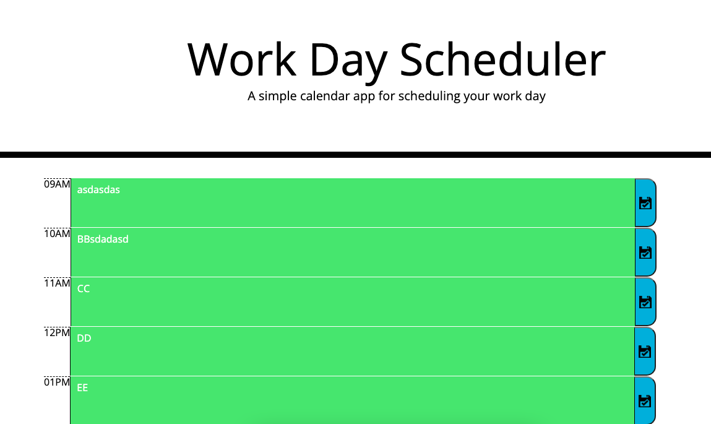

# <Work-Day-Scheduler>

## User Story

```md
AS AN employee with a busy schedule
I WANT to add important events to a daily planner
SO THAT I can manage my time effectively
```

## Acceptance Criteria

```md
GIVEN I am using a daily planner to create a schedule
WHEN I open the planner
THEN the current day is displayed at the top of the calendar
WHEN I scroll down
THEN I am presented with timeblocks for standard business hours
WHEN I view the timeblocks for that day
THEN each timeblock is color coded to indicate whether it is in the past, present, or future
WHEN I click into a timeblock
THEN I can enter an event
WHEN I click the save button for that timeblock
THEN the text for that event is saved in local storage
WHEN I refresh the page
THEN the saved events persist
```

## Description
Work-day-scheduler is built to record different todo's in a normal 09:00AM - 05:00PM day job. The time-block, text and save button are added dynamically using Jquery. Major learnings were deeper understanding of Jquery parent/sibling selectors.

## Application
The workday scheduler can be accessed with this link:
[Work-Day-Scheduler](https://razor-ray.github.io/Work-Day-Scheduler/)

## Screenshot
Below is a screenshot of the application


## Installation
Google Chrome or any other equivalent is required to run this project.
Google chrome can be downloaded from [Google](https://www.google.com.au/chrome/?brand=YTUH&gclid=Cj0KCQiA2sqOBhCGARIsAPuPK0j6dMkIFsf2OpJKfpZegbBj_cN3xsyBrr3XNPesFf1JWMF_9SC3x_4aAv2mEALw_wcB&gclsrc=aw.ds)

## Usage
After installaion of google chrome, this application can be run in the browser directly.